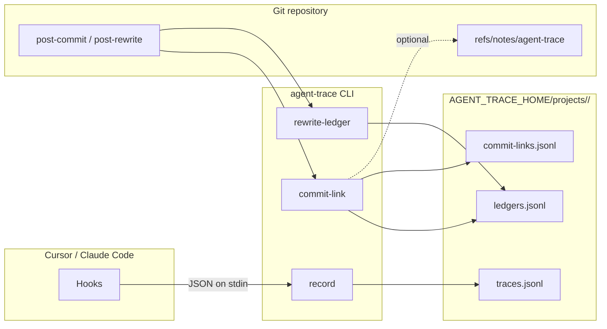

# Concepts — Overview

agent-trace sits at the intersection of **your git history**, **IDE/agent hook events**, and **optional network sync**. This page ties the moving parts together before you dive into specialized topics.

---

## Data flow (happy path)

1. **Hooks** invoke **`agent-trace record`** with a JSON payload on stdin. The implementation is designed **not to crash the agent** if something goes wrong.
2. **`commit-link`** (usually from **`post-commit`**) correlates the new commit with traces in the current session window and **writes the ledger** — the deterministic, binary map of which line ranges are AI-attributed versus not.
3. **`rewrite-ledger`** (from **`post-rewrite`**) remaps ledger rows when commit SHAs change (rebase, amend).
4. **Git notes** commands optionally attach a JSON blob to commits for teammates who fetch `refs/notes/agent-trace`.

---

## Local-first vs remote

| Layer | Default behavior |
|-------|------------------|
| **Local JSONL** | Always the source of truth for traces, ledgers, commit-links, session summaries on your machine. |
| **HTTP remote** | Purely optional; you **`push`**, **`pull`**, or **`sync`** explicitly. |
| **Git notes** | Optional transport of **pointers and optional inline sections** alongside the git object graph. |

The HTTP remote is a **datastore**, not a server that performs blame at query time.

---

## Deterministic attribution

At **`agent-trace blame`** time, the tool consults the **ledger** (and, when present, usable inline structures inside a git note). It does **not** fall back to scoring, token overlap, or time-based heuristics for missing data.

That design choice means:

- Output is **auditable** and stable for a given commit + file + ledger snapshot.
- Absence of proof surfaces as **No attribution** rather than a misleading guess.

See [Attribution ledger](attribution-ledger.md).

---

## Major subsystems

| Topic | Document |
|-------|----------|
| Where `project_id` comes from, worktrees, re-clones | [Project identity & storage](project-identity.md) |
| Hook events, global vs project hooks | [Hooks & recording](hooks-and-recording.md) |
| Ledger construction and blame | [Attribution ledger](attribution-ledger.md) |
| Named remotes, push/pull semantics | [Remotes & sync](remotes-and-sync.md) |
| `refs/notes/agent-trace` payload | [Git notes](git-notes.md) |
| Pluggable summarizers | [Session summaries](session-summaries.md) |
