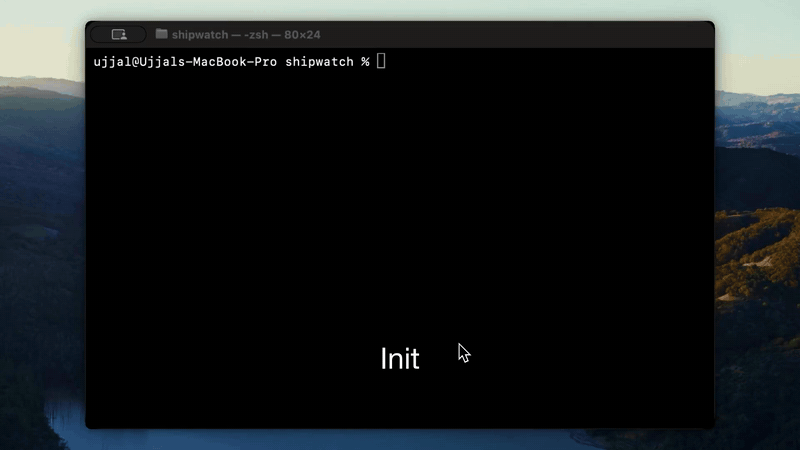

# Getting started

This page is the shortest path from **no setup** to **seeing attribution** on a file. For install options and uninstall steps, see [Installation](installation.md).



[▶ Watch the 3-minute demo](https://www.youtube.com/watch?v=J4LPhV9wURg)

---

## Prerequisites

- **Python 3.9 or newer** on your PATH (required by the official installer and in-repo usage).
- A **git repository** for the project you want to trace.
- One or more supported coding tools if you want automatic recording: **Cursor**, **Claude Code**, and/or **Codex CLI**.

---

## Step 1 — Install the CLI

**PyPI** (CLI only):

```bash
pip install agent-trace-cli
```

**Or** use the one-liner / `./install.sh` from a clone — that path also installs the **file viewer** and adds the `at` short alias. See [Installation](installation.md).

After installation:

```bash
agent-trace --version
```

---

## Step 2 — (Recommended) Global hooks

Install hooks **once** in your home directory so every repo can emit traces without per-project Cursor/Claude configuration:

```bash
agent-trace hooks setup-global
```

Optional: limit to one tool:

```bash
agent-trace hooks setup-global --tool cursor
agent-trace hooks setup-global --tool claude
agent-trace hooks setup-global --tool codex
```

Verify:

```bash
agent-trace hooks status
```

See [Hooks & recording](concepts/hooks-and-recording.md) for what each hook event does and where files are written.

---

## Step 3 — Initialize each repository

From the root of a git checkout:

```bash
cd /path/to/your/repo
agent-trace init
```

`init` is intentionally **zero-prompt** (similar in spirit to `git init`). It typically:

- Ensures **per-project configuration** under your agent-trace home directory.
- Writes a **stable project anchor** under the shared git directory (worktree-aware).
- Installs **git hooks** (`post-commit`, `post-rewrite`) when appropriate.
- Configures **git notes refspecs** for `origin` when that remote exists.

Check that everything looks sane:

```bash
agent-trace status
agent-trace doctor
```

---

## Step 4 — Produce a commit

Work with your agent as usual (edits, shell commands, session boundaries). When you **commit**, the post-commit hook runs **`agent-trace commit-link`**, which links the commit to the active traces and appends an **attribution ledger** for that commit.

If you skip committing, blame will not have ledger rows for those changes yet.

---

## Step 5 — Inspect attribution

```bash
agent-trace blame path/to/file.py
```

Optional JSON for scripting:

```bash
agent-trace blame path/to/file.py --json
```

To open the web **file viewer** (git blame + agent-trace blame):

```bash
agent-trace viewer
```

---

## Step 6 — (Optional) Conversation context

For line ranges that the ledger attributes to AI, you can resolve the backing transcript:

```bash
agent-trace context path/to/file.py --lines 10-80
```

Add `--full` for the entire transcript text (can be large). See [context](reference/context.md).

---

## Step 7 — (Optional) Team remotes and git notes

- Add an HTTP **remote** and run **`agent-trace push`** / **`pull`** / **`sync`** when you want to share datastore-style artifacts. See [Remotes & sync](concepts/remotes-and-sync.md).
- Use **`agent-trace notes`** to attach JSON to commits under `refs/notes/agent-trace` so metadata can travel with normal git fetch/push once refspecs are configured. See [Git notes](concepts/git-notes.md).

---

## Common pitfalls

| Symptom | What to check |
|---------|----------------|
| `blame` shows lots of **No attribution** | You have not committed since edits, or ledger/git-note data is missing for those lines. See [Attribution ledger](concepts/attribution-ledger.md). |
| No traces recorded | Hooks not installed or not firing; run `doctor`. For global hooks, the edited file must live inside an **initialized** repo. |
| Wrong project when cwd is odd | Pass `--project` to `blame`, `context`, or `viewer`. See each command reference. |

More detail: [Troubleshooting](troubleshooting.md).
